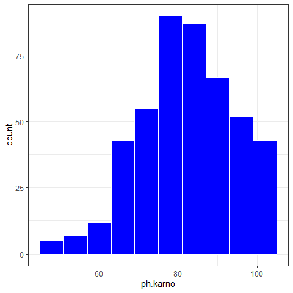
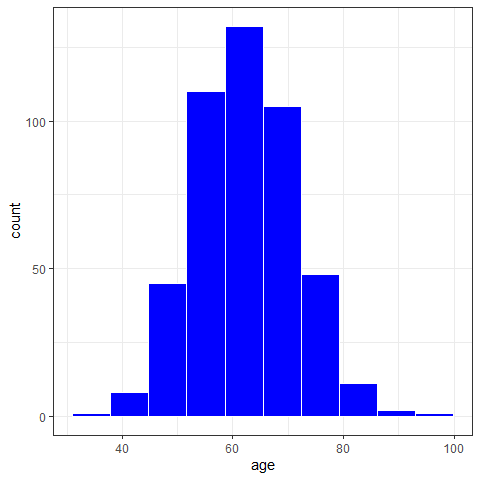
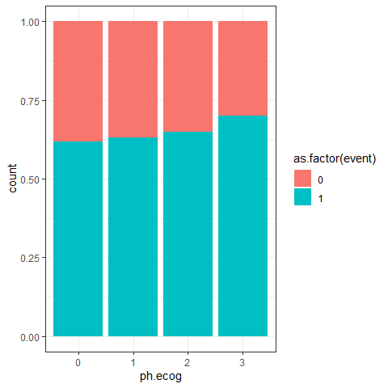
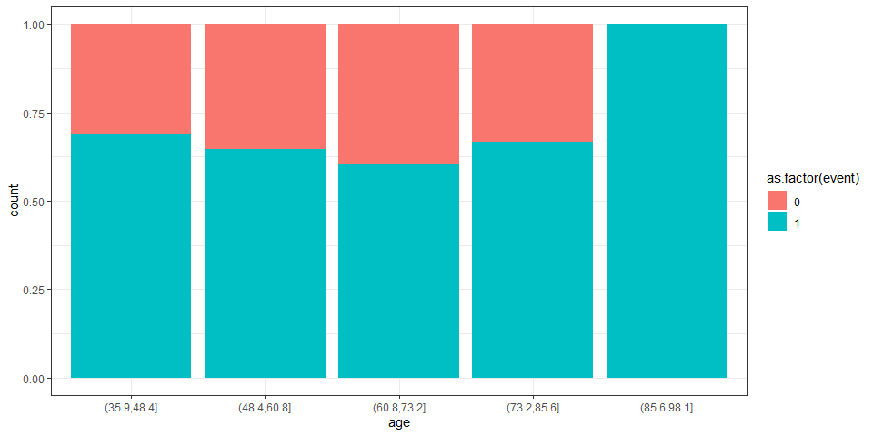
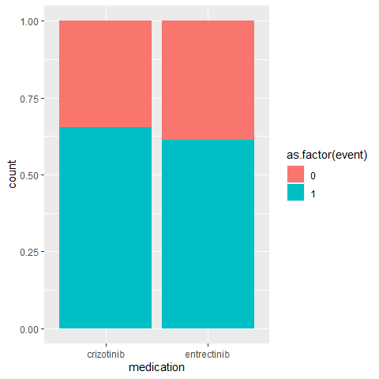
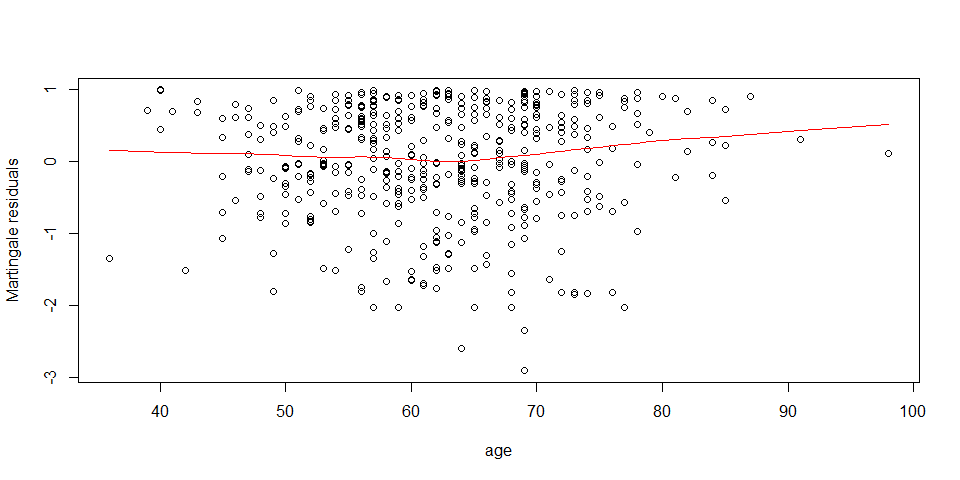
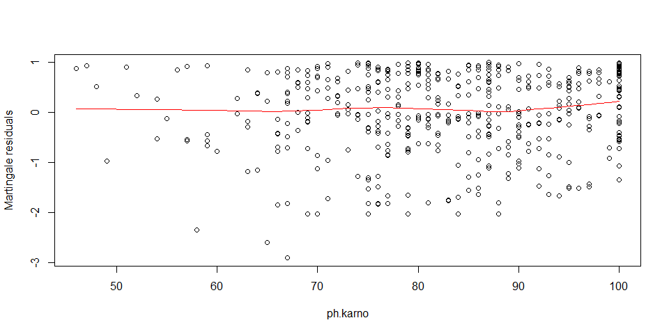

--- 
title:  "Coding Challenge: a Survival Analysis on Simulated Cancer Data"
author: "Danny Scarponi"
site: bookdown::bookdown_site
output:
    bookdown::pdf_book:
        includes:
            in_header: header.tex
    bookdown::gitbook:
        config:
            sharing: null
        css: 'style.css'
        highlight: tango
        includes:
            in_header: _toggle.html
        keep_md: TRUE
bibliography: references.bib  
linkcolor: blue
documentclass: book
link-citations: yes
description: ""
---


# Summary

## Data Preparation

The three csv files provided (NSCLC_medications, NSCLC_dates, NSCLC_demographics) were merged into a single dataframe by `id` value. The medications' names were standardised, accounting for different spellings of the same medication. Three observations reporting both an end date and a death date were deleted. Two columns were then created: `event`, with zeros for censored data and ones for observations with a death date, and `fu`, containing the follow up time in weeks. There were 34 observations with a negative follow up time. Since a negative value is clearly incorrect, and since follow up time is a response variable (and not a covariate), we decided to delete these $34$ observations. The derived dataset was then used to conduct our analysis.

## Cohort Description

The cohort was composed of $463$ patients, with age range $[36,98]$ and mean age $62.4$. Around $61\%$ of the patients were male, and $39\%$ female. Half of the patients were given Crizotinib and half Entrectinib ($231$ vs $232$). The vast majority of patients ($96\%$) had an ECOG score between zero and two, with only $10$ ECOG scores equal to three. The Karnofsky score was always between $45$ and $100$, with the vast majority of scores ($93\%$) above $65$. The weight loss covariate was simmetrically distributed with mean $10.9$ and range $[-29, 52.4]$. A visual inspection suggested that higher values of the ECOG score are associated with higher percentages of deaths.
The percentage of deaths was slightly higher in patients treated with Crizotinib compared to patients treated with Entrectinib ($65\%$ vs $61\%$). Visualisations of the percentage of deaths by sex, age, weight loss and Karnofsky score did not highlight any other clear association.

## Data Imputation

Of the 463 observations in the derived dataset, 37 had missing data: 27 observations only missing weight loss, 7 only missing the ECOG score, one missing both of them and 2 missing weight loss and Karnofsky score. We assumed that the data was missing at random or completely at random and implemented multiple imputation with the `mice` package. We used the `HowManyImputation` package, based on the work of Von Hippel (@von2020many), to estimate how many imputations were needed to then produce consistent estimates in our survival analysis. Graphical comparisons of the observed and imputed data were conducted, as a diagnostic of the imputation process.

## Survival Analysis

To assess whether the survival of patients differs in the two treatment groups, a Cox Regression model was fitted to each of the $20$ imputed datasets. The statistics from each model were then pooled and analysed. **The treatment (Crizotinib vs Entrectinib) was not a statistically significant predictor for the survival of patients (p-value $0.28$)**. The ECOG score had instead a highly significant p-value (0.001 for ECOG score 3 compared to score 0). Higher ECOG scores corresponded to higher hazard rates, with score 3 changing the hazard by a factor of $5.35$ $[95\% \text{ CI } (1.94-14.73)]$, compared to score zero. 

Several diagnostics were run to assess the validity of the Cox Regression analysis. The proportional hazards assumption was investigated using Schoenfeld residuals, the linearity between the log-hazard and the continuous covariates was investigated by plotting Martingale residuals and the absence of influential observations (outliers) was inspected by plotting deviance residuals. These diagnostic tests suggested that our analysis was valid.

Since missing variables were imputed, we performed a sensitivity analysis, comparing the results of our main analysis with the results obtained by fitting a Cox Regression model only using the complete observations. The two procedures were in agreement and both suggested that treatment (Crizotinib vs Entrectinib) was not a statistically significant predictor for the survival of patients.


# Data Preparation


We have dataframes `medications`, `dates` and `demographics` corresponding to the three csv files provided. Let's look at their structure:


```r
str(medications)
```

```
## 'data.frame':	500 obs. of  2 variables:
##  $ id             : int  1 2 3 4 5 6 7 8 9 10 ...
##  $ medication_name: chr  "crizotinib" "crizotinib" "crizotinib" "entrectinib" ...
```

```r
str(dates)
```

```
## 'data.frame':	500 obs. of  4 variables:
##  $ id                  : int  1 2 3 4 5 6 7 8 9 10 ...
##  $ first_diagnosis_date: chr  "2021-08-30" "2000-05-12" "2016-10-25" "2001-12-24" ...
##  $ death_date          : chr  "2023-03-26" "" "2017-04-16" "" ...
##  $ end_date            : chr  "" "2002-02-23" "" "2002-12-08" ...
```

```r
str(demographics)
```

```
## 'data.frame':	500 obs. of  6 variables:
##  $ id      : int  1 2 3 4 5 6 7 8 9 10 ...
##  $ age     : int  61 62 57 76 56 54 71 69 68 61 ...
##  $ sex     : int  1 0 0 1 1 0 0 1 1 0 ...
##  $ ph.ecog : int  1 0 1 2 1 0 0 2 1 1 ...
##  $ ph.karno: int  90 95 89 66 80 100 96 81 68 84 ...
##  $ wt.loss : num  0.964 18.004 17.372 3.576 8.679 ...
```

All dataframes have 500 observations. Let us merge them into a unique dataframe, according to their `id`:


```r
merged <- merge(demographics, medications, by="id")
merged <- merge(merged, dates, by = "id")
```

Finally we change the column name `medication_name` to `medication`, since there is no risk of confusion (having only one column referring to medications). Similarly, we rename `end_date` to `end`, `first_diagnosis_date` to `first_diag` and `death_date` to `death`.


```r
colnames(merged)[7] <- "medication"
colnames(merged)[8] <- "first_diag"
colnames(merged)[9] <- "death"
colnames(merged)[10] <- "end"
```


## Medication Variable
Let's explore the `medication` variable:


```r
table(merged$medication)
```

```
## 
##  crizotinab  crizotinib entrectinib Entrectinib 
##          20         226         205          49
```

We see that there are no missing data and that each medication is reported in two different ways. Let's uniformise that:


```r
merged$medication[merged$medication=="crizotinab"] <- "Crizotinib" 
merged$medication[merged$medication=="Entrectinib"] <- "Entrectinib" 
table(merged$medication)
```

```
## 
##  crizotinib  Crizotinib entrectinib Entrectinib 
##         226          20         205          49
```

## Dates Variables
Let's now examine the three variables related to time:


```r
sum(is.na(merged$first_diag))
```

```
## [1] 0
```

```r
sum(merged$end != "")
```

```
## [1] 188
```

```r
sum(merged$death != "")
```

```
## [1] 315
```

We see that no participant has first diagnosis date missing. We also note that we must have three participants for which we have both an end date and a death date. Let's investigate these observations:


```r
merged %>% filter(end != "" & death != "")
```

```
##    id age sex ph.ecog ph.karno    wt.loss  medication first_diag      death
## 1 106  74   1       1       76 12.1418510  crizotinib 2010-01-09 2010-10-15
## 2 294  70   1       1       80 24.2845210  crizotinib 2004-07-23 2005-08-18
## 3 468  51   1       1       78  0.6657683 entrectinib 2007-11-20 2008-09-17
##          end
## 1 3021-05-03
## 2 3021-05-03
## 3 3021-05-03
```

The end date for these three participants cannot be correct. It might be plausible that the death dates are correct and one could proceed by simply working with those (discarding the end dates for these three participants). To be safe, in absence of further information, we delete these three observations.


```r
merged <- merged %>% filter(end == "" | death == "")
```

We now create a column `event` with ones if a death date was reported and zeros otherwise. We then create the `fu` column, calculating the follow up time for each observation. We finally delete the `first_diag`, `end` and `death` columns. 


```r
merged <- merged %>% mutate(event = ifelse(death != "", 1, 0))
merged$fu[merged$event==1] <- with(merged, difftime(death[event==1], 
                                                    first_diag[event==1], units = "weeks"))
merged$fu[merged$event==0] <- with(merged, difftime(end[event==0],
                                                    first_diag[event==0], units = "weeks"))
merged <- select(merged, -c(first_diag, end, death))
```

Let's now analyse the `fu` variable:


```r
summary(merged$fu)
```

```
##     Min.  1st Qu.   Median     Mean  3rd Qu.     Max. 
##   -59.57    24.14    45.01   361.02    64.71 52668.28
```

We see that for some observations the follow-up time is negative. Let's count the number of observations with this property:


```r
sum(merged$fu <0) 
```

```
## [1] 34
```

Since a negative follow up time is not acceptable, in absence of further information (which could be gathered for example by liaising with who created the original datasets) we delete these 34 observations. Note that we do not impute these missing values from other variables, since they are response variables. We will use imputation later for observations missing covariates.


```r
merged <- filter(merged, fu >=0)
```

## Demographic Variables
Let's now check the columns relative to demographic aspects.


```r
summary(merged$age)
```

```
##    Min. 1st Qu.  Median    Mean 3rd Qu.    Max. 
##   36.00   56.00   62.00   62.32   69.00   98.00
```

```r
table(recode(merged$sex, "0"="Male", "1"="Female"))
```

```
## 
## Female   Male 
##    181    282
```

```r
table(merged$ph.ecog, useNA = "always")
```

```
## 
##    0    1    2    3 <NA> 
##  141  224   80   10    8
```

```r
summary(merged$ph.karno, useNA = "always")
```

```
##    Min. 1st Qu.  Median    Mean 3rd Qu.    Max.    NA's 
##   46.00   75.00   83.00   82.55   92.00  100.00       2
```

```r
summary(merged$wt.loss, useNA = "always")
```

```
##    Min. 1st Qu.  Median    Mean 3rd Qu.    Max.    NA's 
## -28.980   1.968  10.542  10.918  19.756  52.350      30
```

There are no missing values for age or sex, while we have missing values for ECOG and Karnofsky scores, and for weight loss. Let's calculate how many observations have at least one of those three values missing:


```r
sum(is.na(merged$ph.ecog) | is.na(merged$ph.karno) | is.na(merged$wt.loss))
```

```
## [1] 37
```

There are 37 such observations, which constitute 8% of the observations in `merged`. We will use multiple imputation in order to leverage the full potential of the information contained in `merged`.

# Cohort Description

Let us check the distribution of our covariates:


```r
table(recode(merged$sex, "0"="Male", "1"="Female"))
```

```
## 
## Female   Male 
##    181    282
```

```r
table(merged$medication)
```

```
## 
##  crizotinib entrectinib 
##         231         232
```

We have more male than female individuals in our dataset ($61\%$ vs $39\%$), while the two treatment groups have very similar size. 


```r
table(merged$ph.ecog)
```

```
## 
##   0   1   2   3 
## 141 224  80  10
```

```r
ggplot(merged, aes(x=ph.ecog)) + 
  geom_bar(color = "white", fill = "blue") + theme_bw()
```

```
## Warning: Removed 8 rows containing non-finite values (`stat_count()`).
```


The vast majority of individuals have ECOG score between zero and two, with only $10$ ECOG scores equal to three. 


```r
ggplot(merged, aes(x=ph.karno)) + 
  geom_histogram(bins = 10, color = "white", fill = "blue") + theme_bw()
```

```
## Warning: Removed 2 rows containing non-finite values (`stat_bin()`).
```



The Karnofsky score is always between $45$ and $100$, with the vast majority of scores above $65$.


```r
ggplot(merged, aes(x=wt.loss)) + 
  geom_histogram(bins=10, color = "white", fill = "blue") + theme_bw()
```

```
## Warning: Removed 30 rows containing non-finite values (`stat_bin()`).
```


```r
summary(merged$wt.loss)
```

```
##    Min. 1st Qu.  Median    Mean 3rd Qu.    Max.    NA's 
## -28.980   1.968  10.542  10.918  19.756  52.350      30
```

The weight loss covariate has a rather symmetrical distribution, with mean $10.9$ and range $[-29, 52.4]$.


```r
ggplot(merged, aes(x=age)) + 
  geom_histogram(bins=10, color = "white", fill = "blue") + theme_bw()
```



```r
summary(merged$age)
```

```
##    Min. 1st Qu.  Median    Mean 3rd Qu.    Max. 
##   36.00   56.00   62.00   62.32   69.00   98.00
```

The age covariate has a relatively symmetrical distribution, with mean $62.37$ and range $[36,98]$.


```r
table(merged$ph.ecog, recode(merged$event, "0" = "Censored", "1" = "Death"))
```

```
##    
##     Censored Death
##   0       54    87
##   1       83   141
##   2       28    52
##   3        3     7
```

```r
subset(merged, !is.na(ph.ecog)) %>%
     ggplot( aes(x=as.factor(ph.ecog), fill = as.factor(event))) +
     geom_bar(position = "fill") + 
     labs(x = "ph.ecog") +
     theme_bw()
```



This table and plot suggest that higher values of the ECOG score are associated with higher percentages of deaths.

The plots below do not show a clear association between Karnofsky score/age/sex/wt.loss and the percentage of deaths observed.


```r
subset(merged, !is.na(ph.karno)) %>%
     ggplot(aes(x=cut(ph.karno,5), fill = as.factor(event))) +
     geom_bar(position = "fill") + 
     labs(x = "ph.karno") +
     theme_bw()
```


```r
subset(merged, !is.na(age)) %>%
     ggplot(aes(x=cut(age,5), fill = as.factor(event))) +
     geom_bar(position = "fill") + 
     labs(x = "age") +
     theme_bw()
```



```r
subset(merged, !is.na(sex)) %>%
     ggplot(aes(x=sex, fill = as.factor(event))) +
     geom_bar(position = "fill") + 
     labs(x = "sex") +
     theme_bw()
```


```r
subset(merged, !is.na(wt.loss)) %>%
     ggplot(aes(x=cut(wt.loss,5), fill = as.factor(event))) +
     geom_bar(position = "fill") + 
     labs(x = "weight loss") +
     theme_bw()
```


Finally let us produce a similar plot for the type of treatment:


```r
subset(merged, !is.na(medication)) %>%
     ggplot(aes(x=medication, fill = as.factor(event))) +
     geom_bar(position = "fill")
```



Here we see a (small) difference in percentage by treatment, with Entrectinib having a lower percentage of deaths. Our survival analysis will investigate if this difference is statistically significant.

We conclude this section by comparing the ECOG scores in the two treatment groups:


```r
boxplot(merged$ph.ecog ~ merged$medication, xlab="", ylab="ph.ecog")
```


This distribution of the ECOG scores does not seem to change substantially between the two treatment groups.

# Data Imputation

## Multiple Imputation

In this analysis we assume that the missing values are either missing completely at random or missing at random. Under this assumption, we use multiple imputation via the MICE package to impute the missing data. Let us start with visualising the missing data:


```r
md.pattern(merged)
```


We see that there are 27 observations only missing weight loss, 7 only missing the ECOG score, one missing both of them and 2 missing weight loss and Karnofsky score. We use the `mice` package to impute the missing data:


```r
merged$sex = as.factor(merged$sex)
merged$ph.ecog = as.factor(merged$ph.ecog)
merged$medication = as.factor(merged$medication)
imputed_data <- mice(merged, m=20, seed = 101)
```


```r
summary(imputed_data)
```

```
## Class: mids
## Number of multiple imputations:  20 
## Imputation methods:
##         id        age        sex    ph.ecog   ph.karno    wt.loss medication 
##         ""         ""         ""  "polyreg"      "pmm"      "pmm"         "" 
##      event         fu 
##         ""         "" 
## PredictorMatrix:
##          id age sex ph.ecog ph.karno wt.loss medication event fu
## id        0   1   1       1        1       1          1     1  1
## age       1   0   1       1        1       1          1     1  1
## sex       1   1   0       1        1       1          1     1  1
## ph.ecog   1   1   1       0        1       1          1     1  1
## ph.karno  1   1   1       1        0       1          1     1  1
## wt.loss   1   1   1       1        1       0          1     1  1
```

Here we chose 20 imputations, as suggested in @von2020many. We then fit a Cox Regression model to the imputed data and use the `HowManyImputations` package to check whether 20 imputations are enough to have consistent estimates.


```r
models <- with(imputed_data,coxph(Surv(fu, event) ~ age+sex+ph.ecog+ph.karno+wt.loss+medication))
how_many_imputations(models)
```

```
## [1] 5
```

The suggested (minimum) number of imputations is below 20, so there is no need to create more imputations.

## Checking Imputed Data

We plot the observed and imputed data together to check whether the imputed values are plausible compared to the observed values. Let us focus on the weight loss covariate, which was by far the main source of missingness.


```r
stripplot(imputed_data, wt.loss ~ .imp,
           col = c("gray", "black"),
           pch = c(21, 20),
           cex = c(1, 1.5))
```


The `stripplot` function plots the observed data (labeled as 1 on the x-axis), and plots the observed and imputed data together for each completed dataset (labeled as 2 to the number of imputations + 1 on the x-axis). Here we see that the imputed values are not far away from the distribution of the observed values and they do not only span a subset of the distribution of the observed values. 

We can also compare the density of the weight loss covariate in each imputed dataset and compare it with the density in the observed data:


```r
densityplot(imputed_data, xlab = "weight loss")
```


Also this plot shows imputed distributions in line with the distribution in the observed data. 

# Survival Analysis

## Univariate Analysis

Let us start by estimating the survival curve in the two treatment groups for the first imputed dataset:


```r
imputed_1 <- complete(imputed_data,1)
surv_fit <- survfit(Surv(fu, event)~medication, data = imputed_1)
plot(surv_fit, xlim=c(0,120), col=c("red","blue"), lty=1, lwd=2, 
     xlab="Weeks", ylab="Survival")
legend(x = "topright",          # Position
       legend = c("Crizotinib", "Entrectinib"),  # Legend texts
       lty = c(1, 1),           # Line types
       col = c("red", "blue"),           # Line colors
       lwd = 2)  
```


The two curves do not seem substantially different. Let's now run a Log-rank test to check whether the difference in the two estimated curves is statistically significant:


```r
survdiff(Surv(fu, event)~medication, data = imputed_1)
```

```
## Call:
## survdiff(formula = Surv(fu, event) ~ medication, data = imputed_1)
## 
##                          N Observed Expected (O-E)^2/E (O-E)^2/V
## medication=crizotinib  231      151      142     0.533      1.04
## medication=entrectinib 232      142      151     0.503      1.04
## 
##  Chisq= 1  on 1 degrees of freedom, p= 0.3
```

The test suggests that there is not enough evidence to reject the null hypothesis that the two survival curves are not different. Of course, this is a univariate analysis, which does not account for differences in all other covariates between the two treatment groups, and in this analysis we only looked at the first imputed dataset. To account for all covariates and all imputed datasets we fit a Cox Multiple Regression model to each imputed dataset and then pool the statistics obtained.

## Cox Multiple Regression 

To assess whether the survival of patients differs in the two treatment groups, we fitted a Cox Regression model for each of the imputed datasets. Let us analyse the pooled statistics for the fitted Cox models:


```r
summary(pool(models), conf.int = TRUE)
```

```
##                    term     estimate   std.error   statistic       df
## 1                   age  0.007112186 0.006997901  1.01633138 282.1335
## 2                  sex1  0.001256594 0.120209962  0.01045333 282.5921
## 3              ph.ecog1  0.398998873 0.167500975  2.38206896 277.8997
## 4              ph.ecog2  0.922655472 0.255806244  3.60685282 261.1758
## 5              ph.ecog3  1.677028332 0.514363717  3.26039392 277.7397
## 6              ph.karno  0.019038762 0.008281139  2.29905114 275.9777
## 7               wt.loss -0.004262902 0.004726079 -0.90199554 247.0426
## 8 medicationentrectinib -0.128153604 0.118168728 -1.08449677 282.6867
##        p.value        2.5 %      97.5 %
## 1 0.3103423672 -0.006662537 0.020886910
## 2 0.9916669789 -0.235363988 0.237877176
## 3 0.0178886646  0.069266993 0.728730754
## 4 0.0003712572  0.418950326 1.426360618
## 5 0.0012512576  0.664481731 2.689574933
## 6 0.0222491550  0.002736536 0.035340987
## 7 0.3679378027 -0.013571448 0.005045645
## 8 0.2790686390 -0.360755899 0.104448691
```

This suggests that the ECOG score is a statistically significant predictor, due to the rather small p-values (0.001 for ECOG score 3 compared to score 0). Higher ECOG scores correspond to higher hazard rates, with score 3 changing the hazard by a factor of $5.35=\exp(1.677028332)$ $[95\% \text{ CI } (1.94-14.73)]$, compared to score zero. This result is in accordance with our expectation.

The Karnofsky score also has a small p-value (below 0.05). Higher Karnofsky scores correspond to higher hazard rates, with an increase of one point in the Karnofsky score leading to an increase of $2\%$ $[95\% \text{ CI } (0.3\%-3.6\%)]$ in the hazard. Since higher Karnofsky scores indicate better health conditions, this result is slightly counterintuitive and deserves further investigation.

Even tough the negative coefficient for Entrectinib with respect to Crizotinib is in accordance with our previous remark that the percentage of deaths is lower in patients treated with Entrectinib, **the treatment (Crizotinib vs Entrectinib) was not a statistically significant predictor for the survival of patients (p-value $0.28$)**.

The p-values for all remaining covariates (age, sex, weight loss) also suggest that they are not statistically significant.

## Verifying Assumptions

### Proportional Hazards

To check whether the assumption of proportional hazards is satisfied, we use the Schoenfeld residuals:


```r
Schoen <- with(imputed_data, 
               cox.zph(coxph(Surv(fu, event) ~ age+sex+ph.ecog+ph.karno+wt.loss+medication)) )
p_value <- matrix(0, 20, 6)
for (i in 1:20) {
  for (j in 1:6) 
    p_value[i,j] <- Schoen$analyses[[i]][[1]][j,3]
}
sum(p_value <0.05)
```

```
## [1] 2
```

The element [i,j] in `p_value`, contains the p-value for the proportionality assumption for the jth predictor on the ith imputed dataset. We see that almost no element in `p-value` is below 0.05, suggesting that the proportionality assumption holds for all predictors.

### Linearity

To check whether there is a roughly linear relationship between the log-hazard and the continuous covariates, we start by fitting a Cox model without the continuous covariates. We use the first imputed dataset for this analysis:


```r
cox_categ <- coxph(Surv(fu, event) ~ sex+ph.ecog+medication, data = imputed_1)
```

We then plot the Martingale residuals of such model against the three continuous covariates: 


```r
plot(imputed_1$age, residuals(cox_categ), xlab = "age", ylab = "Martingale residuals")
lines(lowess(imputed_1$age, residuals(cox_categ)), col='red')
```



```r
plot(imputed_1$ph.karno, residuals(cox_categ), xlab = "ph.karno" , ylab = "Martingale residuals")
lines(lowess(imputed_1$ph.karno, residuals(cox_categ)), col='red')
```



```r
plot(imputed_1$wt.loss, residuals(cox_categ), xlab = "weight loss", ylab = "Martingale residuals")
lines(lowess(imputed_1$wt.loss, residuals(cox_categ)), col='red')
```


The lowess lines are relatively straight. This, and the fact that the same is true for all other imputed datasets, suggest that the linearity assumption is satisfied.

### Influential Observations

To search for possible outliers, we plot the deviance residuals using the `ggcoxdiagnostics` function:


```r
ggcoxdiagnostics(coxph(Surv(fu, event) ~ age+sex+ph.ecog+ph.karno+wt.loss+medication, 
                       data = imputed_1), type = "deviance")
```

```
## Warning: `gather_()` was deprecated in tidyr 1.2.0.
## i Please use `gather()` instead.
## i The deprecated feature was likely used in the survminer package.
##   Please report the issue at <https://github.com/kassambara/survminer/issues>.
```

```
## `geom_smooth()` using formula = 'y ~ x'
```


The plot suggests that the residuals for the first imputed dataset are roughly symmetrically distributed around zero and most of them fall within the range $[-2,2]$. It is easy to check that the same is true for the residuals of all other imputed datasets. We can therefore assume that none of the observations is terribly influential individually.

## Sensitivity Analysis

Since we imputed missing variables, it is useful to compare the results of our main analysis with the results we obtain by fitting a Cox Regression model only using the complete observations.


```r
merged_inc <- merge(demographics, medications, by="id")
merged_inc <- merge(merged_inc, dates, by = "id")
colnames(merged_inc)[7] <- "medication"
colnames(merged_inc)[8] <- "first_diag"
colnames(merged_inc)[9] <- "death"
colnames(merged_inc)[10] <- "end"
merged_inc$medication[merged_inc$medication=="crizotinab"] <- "Crizotinib" 
merged_inc$medication[merged_inc$medication=="Entrectinib"] <- "Entrectinib" 
merged_inc <- merged_inc %>% filter(end == "" | death == "")
merged_inc <- merged_inc %>% mutate(event = ifelse(death != "", 1, 0))
merged_inc$fu[merged_inc$event==1] <- with(merged_inc, difftime(death[event==1], 
                                                    first_diag[event==1], units = "weeks"))
merged_inc$fu[merged_inc$event==0] <- with(merged_inc, difftime(end[event==0],
                                                    first_diag[event==0], units = "weeks"))
merged_inc <- select(merged_inc, -c(first_diag, end, death))
merged_inc <- filter(merged_inc, fu >0)
merged_inc <- filter(merged_inc, !(is.na(wt.loss) | is.na(ph.karno) | is.na(ph.ecog)))
merged_inc$sex = as.factor(merged_inc$sex)
merged_inc$ph.ecog = as.factor(merged_inc$ph.ecog)
merged_inc$medication = as.factor(merged_inc$medication)
coxph(Surv(fu, event) ~ age+sex+ph.ecog+ph.karno+wt.loss+medication, data = merged_inc)
```

```
## Call:
## coxph(formula = Surv(fu, event) ~ age + sex + ph.ecog + ph.karno + 
##     wt.loss + medication, data = merged_inc)
## 
##                            coef exp(coef)  se(coef)      z        p
## age                    0.006569  1.006591  0.007388  0.889   0.3740
## sex1                  -0.040050  0.960741  0.127322 -0.315   0.7531
## ph.ecog1               0.441058  1.554351  0.178693  2.468   0.0136
## ph.ecog2               1.045063  2.843579  0.263616  3.964 7.36e-05
## ph.ecog3               1.340776  3.822007  0.577542  2.322   0.0203
## ph.karno               0.016018  1.016147  0.008770  1.826   0.0678
## wt.loss               -0.004172  0.995837  0.004802 -0.869   0.3850
## medicationCrizotinib   0.533680  1.705195  0.288295  1.851   0.0641
## medicationentrectinib -0.142374  0.867296  0.135750 -1.049   0.2943
## medicationEntrectinib -0.048936  0.952242  0.218375 -0.224   0.8227
## 
## Likelihood ratio test=24.81  on 10 df, p=0.00571
## n= 425, number of events= 267
```

These results are in agreement with what found in our main analysis: the only covariates having p-value below 0.05 are the ECOG and the Karnofsky scores.

<!--chapter:end:index.Rmd-->

